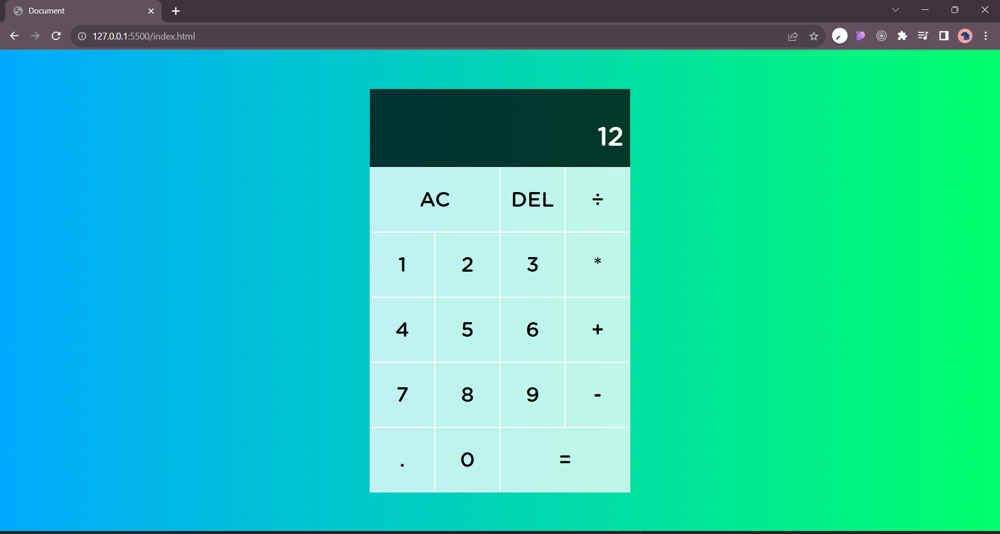

# Calculator App

Welcome to the Calculator App! This is a simple calculator built using HTML, CSS, and JavaScript that allows you to perform basic arithmetic calculations.

## Features

- Addition, subtraction, multiplication, and division operations.
- Clear button to reset the calculator.
- Responsive design for various screen sizes.

## Demo

Check out the live demo of the Calculator App [here](https://your-demo-link.com).

## Installation

1. Clone the repository: `git clone https://github.com/shubhamkolape/calculator_With_JS.git`
2. Navigate to the project directory: `cd Calculator_With_JS`
3. Open `index.html` in your web browser.

## Usage

1. Enter numbers using the number buttons.
2. Click the operation buttons (+, -, *, /) to select the desired operation.
3. Click the "=" button to display the result.
4. To clear the current input or result, click the "C" button.

## Design

The Calculator App features a clean and intuitive design. It includes a responsive layout that adapts to different screen sizes, making it usable on both desktop and mobile devices.

## Technologies Used

- HTML
- CSS
- JavaScript

## Contributing

Contributions are welcome! If you find any bugs or have suggestions for improvements, please create an issue or a pull request in this repository.

## License

This project is licensed under the [MIT License](LICENSE).

---

Feel free to customize this `README.md` template to match the specifics of your project. You can add more sections, update the content, and include any additional information you think is relevant.
